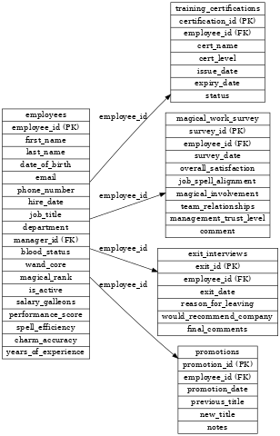

# ✨ Spell & Scroll Solutions, Inc. — HR Analytics Project ✨

  

  <strong>Wizard-grade HR analytics for a fictional magical company — built to demonstrate SQL skills, data design, and storytelling.</strong>

---

## 🧙 Project Overview
Step into the enchanted world of **Spell & Scroll Solutions, Inc.**, where magic meets metrics. This project simulates a realistic HR dataset layered with wizarding-world flair — including employee data, magical certifications, mystical promotions, sentiment surveys, and exit interviews.

> 📊 Designed for SQL, Python, and data visualization tools like Tableau and Power BI.

---

## 📂 Dataset Contents
This project features five interconnected tables with rich, semi-messy, realistic data:

| Table Name               | Description                                             |
|--------------------------|---------------------------------------------------------|
| `employees`              | Master employee list with magical details & performance |
| `training_certifications`| Magical training & skill certifications per employee   |
| `magical_work_survey`    | Employee sentiment, morale, and engagement levels      |
| `exit_interviews`        | Reasons for employee departures & recommendations      |
| `promotions`             | Internal promotions and advancement records            |

📄 Each table is described in detail in the [📘 HR Data Documentation](./HR_Data_Documentation).

---

## 🛠️ Tech Stack
- **Python** – data generation & transformation (Faker, pandas)
- **PostgreSQL** – database-ready schema with foreign key relationships
- **SQL** – joins, aggregates, exploratory queries
- **Tableau / Power BI** – dashboard-ready data structure
- **Graphviz** – Entity Relationship Diagram (ERD)

---

## 🧪 Sample Analysis Ideas
- Analyze satisfaction and magical involvement by department or wand core
- Correlate certifications and promotions with performance metrics
- Track exit trends by team, rank, or magical blood status
- Predict promotion or churn using survey scores + spell efficiency

---

## 🚀 Getting Started
1. Clone the repository
2. Import CSVs into PostgreSQL or your preferred SQL tool
3. Use the [📜 SQL setup script](./wizard_hr_sql_setup) to create schema
4. Explore tables using joins, filters, and dashboards

---

## 🗺️ Entity Relationship Diagram (ERD)

  

---

## 🧙‍♂️ Inspiration
Built to blend data realism with fantasy creativity, this project lets data analysts stretch both **technical muscle** and **storytelling magic**.

> Because who says dashboards can’t sparkle?

---

## ⚠️ Licensing
This is a fictional dataset for learning and portfolio use only. Any resemblance to real magical corporations, living or undead, is purely coincidental.

---

## ✍️ Author
Crafted by a curious analyst and code conjurer. Want help exploring, remixing, or visualizing this data?

**Reach out — let’s make some magic.**

